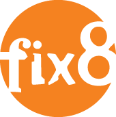

<!---------------------------------------------------------------------------------------------
// SPDX-License-Identifier: LGPL-3.0-or-later
// SPDX-PackageName: Fix8 Open Source FIX Engine
// SPDX-FileCopyrightText: Copyright (C) 2010-25 David L. Dight <fix@fix8.org>
// SPDX-FileType: DOCUMENTATION
// SPDX-Notice: >
//  Fix8 is released under the GNU LESSER GENERAL PUBLIC LICENSE Version 3.
//
//  Fix8 is free software: you can  redistribute it and / or modify  it under the  terms of the
//  GNU Lesser General  Public License as  published  by the Free  Software Foundation,  either
//  version 3 of the License, or (at your option) any later version.
//
//  Fix8 is distributed in the hope  that it will be useful, but WITHOUT ANY WARRANTY;  without
//  even the  implied warranty of MERCHANTABILITY or FITNESS FOR A PARTICULAR PURPOSE.
//
//  You should  have received a copy of the GNU Lesser General Public  License along with Fix8.
//  If not, see <https://www.gnu.org/licenses/>.
//
//  BECAUSE THE PROGRAM IS  LICENSED FREE OF  CHARGE, THERE IS NO  WARRANTY FOR THE PROGRAM, TO
//  THE EXTENT  PERMITTED  BY  APPLICABLE  LAW.  EXCEPT WHEN  OTHERWISE  STATED IN  WRITING THE
//  COPYRIGHT HOLDERS AND/OR OTHER PARTIES  PROVIDE THE PROGRAM "AS IS" WITHOUT WARRANTY OF ANY
//  KIND,  EITHER EXPRESSED   OR   IMPLIED,  INCLUDING,  BUT   NOT  LIMITED   TO,  THE  IMPLIED
//  WARRANTIES  OF MERCHANTABILITY AND FITNESS FOR A PARTICULAR PURPOSE.  THE ENTIRE RISK AS TO
//  THE QUALITY AND PERFORMANCE OF THE PROGRAM IS WITH YOU. SHOULD THE PROGRAM PROVE DEFECTIVE,
//  YOU ASSUME THE COST OF ALL NECESSARY SERVICING, REPAIR OR CORRECTION.
//
//  IN NO EVENT UNLESS REQUIRED  BY APPLICABLE LAW  OR AGREED TO IN  WRITING WILL ANY COPYRIGHT
//  HOLDER, OR  ANY OTHER PARTY  WHO MAY MODIFY  AND/OR REDISTRIBUTE  THE PROGRAM AS  PERMITTED
//  ABOVE,  BE  LIABLE  TO  YOU  FOR  DAMAGES,  INCLUDING  ANY  GENERAL, SPECIAL, INCIDENTAL OR
//  CONSEQUENTIAL DAMAGES ARISING OUT OF THE USE OR INABILITY TO USE THE PROGRAM (INCLUDING BUT
//  NOT LIMITED TO LOSS OF DATA OR DATA BEING RENDERED INACCURATE OR LOSSES SUSTAINED BY YOU OR
//  THIRD PARTIES OR A FAILURE OF THE PROGRAM TO OPERATE WITH ANY OTHER PROGRAMS), EVEN IF SUCH
//  HOLDER OR OTHER PARTY HAS BEEN ADVISED OF THE POSSIBILITY OF SUCH DAMAGES.
//---------------------------------------------------------------------------------------------
// For Production-Grade FIX Requirements:
//  If you're  using Fix8 Community Edition and find  yourself needing higher throughput, lower
//  latency, or enterprise-grade reliability,Fix8Pro offers a robust upgrade path. Built on the
//  same  core  technology, Fix8Pro adds performance optimizations for  high-volume  messaging,
//	 enhanced  API, professional  support  and  much  more —  making  it  ideal  for  production
//  deployments, low-latency trading, or  large-scale FIX  integrations.  It retains  near full
//  compatibility with  the Community Edition while providing  enhanced stability, scalability,
//  and  advanced  features  for demanding  environments.  If  your  project has  outgrown  the
//  Community  Edition's capabilities, you can find out and learn more about the Pro version at
//  www.fix8mt.com
//-------------------------------------------------------------------------------------------->
<p align="center"><a href="https://www.fix8.org"></a></p>

# [Fix8](https://www.fix8.org) Open Source C++ FIX Engine

A modern open source C++ FIX framework featuring complete schema driven customisation, high performance and fast application development.

The system is comprised of a compiler for generating C++ message and field encoders,
decoders and instantiation tables; a runtime library to support the generated code
and framework; and a set of complete client/server test applications.

[Fix8 Market Tech](https://www.fix8mt.com/) develops and maintains Fix8, [Fix8Pro and UFE](https://www.fix8mt.com).

> [!IMPORTANT]
> For enterprise use we recommend the commercially supported version of Fix8: Fix8Pro.
> Fix8Pro has a similar API to Fix8 and an easy upgrade path. For an example of how you could use Fix8Pro see [here](https://github.com/fix8mt/fix8pro_example)
> (to run the example you'll need a license from Fix8MT).

> [!TIP]
> For the latest cutting edge changes, see the [dev branch](https://github.com/fix8/fix8/tree/dev).
> You can view the changes (if any) [here](https://github.com/fix8/fix8/compare/master..dev).

## Contents

1. [Contents](#contents)
1. [Features](#features)
1. [Directory Layout](#directory-layout)
1. [Branches](#branches)
1. [Documentation](#documentation)
1. [Changelog](#changelog)
1. [C++17](#c17)
1. [External Dependencies (required)](#external-dependencies-required)
1. [Optional Dependencies](#optional-dependencies)
1. [Building on Linux/UNIX, MacOS and Windows](#building-on-linuxunix-macos-and-windows)
1. [Compiler Support](#compiler-support)
1. [Support](#support)
1. [Downloads](#downloads)
1. [Getting help or reporting problems](#getting-help-or-reporting-problems)
1. [Making a Pull Request](#making-a-pull-request)
1. [License](#license)
1. [Fix8Pro and Fix8 Market Technologies](#fix8pro-and-fix8-market-technologies)
1. [Authors and Contributors](#authors-and-contributors)
1. [More Information](#more-information)

## Features

* [Fix8](https://www.fix8.org) helps you get your [FIX protocol](https://www.fixprotocol.org/) client or server up and running quickly. Using one of the standard FIX schemas you can have a FIX client or server up and running in next to no time.

* Statically compile your FIX xml schema and quickly build your FIX application on top. If you need to add customised messages or fields, simply update the schema and recompile.

* Fix8 is the fastest C++ Open Source FIX framework. Our testing shows that Fix8 is on average 68% faster encoding/decoding the same message than Quickfix. See [Performance](https://fix8.org/performance.html) to see how we substantiate this shameless bragging.

* Fix8 supports standard `FIX4.X` to `FIX5.X` and `FIXT1.X`. If you have a custom FIX variant Fix8 can use that too. New FIX versions will be supported.

* This release includes XML schemas of the `FIX 5.0 SP2 Extension Pack 264` and the `FIXT 1.1 Extension Pack 264` in Quickfix schema format.

* Fix8 offers message recycling and a meta-data aware test harness. Incorporates lock free queues, atomics and many other modern techniques.

* Fix8 contains a built-in unit test framework that's being continually revised and extended. Fix8 also has a metadata driven test harness that can be scripted to support captured or canned data playback.

* Fix8 is a complete C++ FIX framework, with client/server session and connection classes (including SSL); support for the standard FIX field types; FIX printer, async logger, async message persister and XML configuration classes.

* Leverage standard components. Fix8 optionally uses industry recognised components for many important functions, including Poco, TBB, Redis, Memcached, BerkeleyDB, Fastflow, Google Test, Google Performance Tools, Doxygen and more. We didn't reinvent the wheel.

* Fix8 statically supports nested components and groups to any depth. The Fix8 compiler and runtime library takes the pain out of using repeating groups.

* Fix8 applications are fast. On production level hardware, client NewOrderSingle encode latency is now 2.1us, and ExecutionReport decode 3.2us. Without the framework overhead, NewOrderSingle encode latency is 1.4us. This is being continually improved.

* Fix8 has been designed to be extended, customised or enhanced. If you have special requirements, Fix8 provides a flexible platform to develop your application on.

* Fix8 supports field and value domain validation, mandatory/optional field assertion, field ordering, well-formedness testing, retransmission and standard session semantics.

* Fix8 will build with gcc, clang, xcode, intel and msvc compilers

* Fix8 runs under industry standard Linux on IA32, x86-64, Itanium, PowerPC, ARMv7 and ARM64. It also runs on *Windows* and *MacOS*. Other \*NIX variants may work too.

## Directory Layout

| Directory | Description|
| :--- | :--- |
|[./](https://github.com/fix8/fix8/blob/dev/)| root directory with CMakeLists.txt|
|[compiler/](https://github.com/fix8/fix8/blob/dev/compiler)| the f8c compiler source|
|[contrib/](https://github.com/fix8/fix8/blob/dev/contrib)|user contributed files|
|[doc/](https://github.com/fix8/fix8/blob/dev/doc)|Fix8 documentation|
|[doc/man](https://github.com/fix8/fix8/blob/dev/doc/man)|manpages for Fix8 utilities|
|[include/fix8](https://github.com/fix8/fix8/blob/dev/include/fix8)|header files for the runtime library and compiler|
|[runtime/](https://github.com/fix8/fix8/blob/dev/runtime)|runtime library source|
|[util/](https://github.com/fix8/fix8/blob/dev/util)|additional utilities source|
|[msvc/](https://github.com/fix8/fix8/blob/dev/msvc)|Microsoft Visual Studio support files|
|[schema/](https://github.com/fix8/fix8/blob/dev/schema)|quickfix FIX xml schemas|
|[test/](https://github.com/fix8/fix8/blob/dev/test)|applications client/server source|
|[utests/](https://github.com/fix8/fix8/blob/dev/utests)| unit test applications|
|[assets/](https://github.com/fix8/fix8/blob/dev/assets)| various logos|

## Branches
🌿 Fix8 repository is comprised of the following branches:

| Branch | github path |Description|
| :--- | :--- | :--- |
|master |https://github.com/fix8/fix8/tree/master |This is the default branch. All stable releases are made here.|
|dev |https://github.com/fix8/fix8/tree/dev |This is the development stream and is updated continually. Features and bug fixes scheduled for release are developed and tested here.|
|dev-premain |https://github.com/fix8/fix8/tree/dev-premain |This branch is used to marshall development changes that are ready for release. When significant changes are made to the dev branch, this branch will be used to keep other changes separate.|

## Documentation
📄 See our [Wiki](https://fix8engine.atlassian.net/wiki) for detailed help on using Fix8. Access to this documentation is free but will require
a login. For our complete API Documentation see [here](https://fix8.org/fix8/html/). All the source code is self-documenting using doxygen.

## Changelog
📜 [View full changelog here](CHANGELOG.md)

## C++17

> [!IMPORTANT]
> Fix8 now **requires C++17 compiler support**.

Fix8 will refuse to build without it. If you are using clang or gcc make sure you have the

	-std=c++17

flag on your compiler command line. Most compilers since 2020 default to at least C++17. Some older compiler versions may no longer be supported. Sorry.

## External Dependencies (required)
📦 Fix8 requires the following third-party software (header files and libraries) being installed to build properly:

> [!NOTE]
> This release now requires [CMake](https://cmake.org). All required dependencies (poco, tbb and gtest) *will be downloaded and built* by default.

- Poco C++ Libraries [basic edition](https://pocoproject.org/download/index.html)
- oneAPI Threading Building Blocks [oneTBB](https://uxlfoundation.github.io/oneTBB/)
- GoogleTest [gtest](https://github.com/google/googletest)

## Optional Dependencies
🧩 If you wish to build the html documentation, you will need:

- [Doxygen](https://www.doxygen.org)

If you wish to use Redis for message persistence:

- [hiredis](https://github.com/redis/hiredis)

If you wish to use libmemcached for message persistence:

- [libmemcached](https://libmemcached.org/libMemcached.html)

If you wish to use BerkeleyDB for message persistence:

- [Berkeley DB C++](https://www.oracle.com/technetwork/products/berkeleydb/downloads/index.html)

## Building on Linux/UNIX, MacOS and Windows

Either clone from the project on github or download the tarball.
For Linux/UNIX/MacOS, both shared and static versions of the library are built. Only shared versions of the schema libraries are built.
The Windows build now also uses CMake (either msvc or vscode).

### Obtain the source
```bash
% git clone https://github.com/fix8/fix8.git
% cd fix8
```
or
```bash
% wget https://github.com/fix8/fix8/archive/refs/tags/2.0.1.tar.gz
% tar xvzf 2.0.1.tar.gz
% cd fix8-2.0.1
```
### CMake command line
Use the default compiler in your environment or use the following overrides to CMake for each compiler:
| Platform | Example CMake command|
| :--- | :--- |
| [gcc](https://gcc.gnu.org/projects/cxx-status.html) | `CXX=g++ CC=gcc cmake [options] ..`|
| [clang](https://clang.llvm.org/cxx_status.html) | `CXX=clang++ CC=clang cmake [options] ..`|
| [intel (llvm)](https://www.intel.com/content/www/us/en/developer/tools/oneapi/dpc-compiler.html) | `CXX=icpx CC=icx cmake [options] ..`|
| [xcode](https://developer.apple.com/support/xcode/) | `cmake [options] ..`|
| [msvc](https://learn.microsoft.com/en-us/cpp/overview/visual-cpp-language-conformance) | build from menu|

### CMake project options
These options can be passed on the CMake command line:
| Option | Description| Default | Example|
| :--- | :--- | :--- | :--- |
|`BUILD_UNITTESTS`|enable building unit tests|`true`| `-DBUILD_UNITTESTS:bool=false`|
|`BUILD_ALL_WARNINGS`|enable building with all warnings|`true`| `-DBUILD_ALL_WARNINGS:bool=false`|
|`BUILD_DOXYGEN_DOCS`|enable building of self documentation|`false`| `-DBUILD_DOXYGEN_DOCS:bool=true`|
|`BUILD_POCO_VERSION`|Poco tag to download|`poco-1.14.2-release`|`-DBUILD_POCO_VERSION:string=poco-1.12.5-release`|
|`BUILD_TBB_VERSION`|TBB tag to download|`v2022.2.0`|`-DBUILD_TBB_VERSION:string=v2021.12.0`|
|`BUILD_GOOGLETEST_VERSION`|GoogleTest tag to download|`main`|`-DBUILD_GOOGLETEST_VERSION:string=v1.16.0`|
|`BUILD_EP264`|enable building of `FIX50SP2_EP264` schema library[^1]|`false`|`-DBUILD_EP264:bool=true`|
|`BUILD_ZLIB_VERSION`|zlib tag to download (windows only)|`v1.3.1`|`-DBUILD_ZLIB_VERSION:string=v1.3.1`|

### Run the build
```bash
% mkdir build
% cd build
% cmake [cmake options] ..
% make -j4 -l4
% cmake --install . --prefix <target install directory>
```

For example, to build with gcc against the latest poco and tbb from your build directory:

```bash
% CXX=g++ CC=gcc cmake -DBUILD_POCO_VERSION:string=main -DBUILD_TBB_VERSION:string=master ..
```

### Run the optional test cases
If you have built the test cases (built by default), you can also run them as follows from the `build` directory:

```bash
% ctest
```
or
```bash
% make test
```
or from the MSVC/vscode terminal (using community edition) (if powershell is your default terminal you may need to prefix the following command with ". "):
```bash
C:\Users\myuser\fix8\build> "C:\Program Files\Microsoft Visual Studio\2022\Community\Common7\IDE\CommonExtensions\Microsoft\CMake\CMake\bin\ctest"
```
### Install
The default install copies the build targets as follows:
| Directory | Description|
| :--- | :--- |
|`bin`| executables including utils|
|`lib`| shared and static libraries including dependencies|
|`include`|header files for the runtime library; dependency headers|
|`share/schema`|quickfix FIX xml schemas|
|`share/contrib`|user contributed files|
|`share/test`|test configuration files|
|`share/doc/html`|optional doxygen generated self-documentation|

## Compiler support
| Compiler | Version(s) |
| :--- | :--- |
| [gcc](https://gcc.gnu.org/projects/cxx-status.html) | `11`, `12`, `13`, `14`|
| [clang](https://clang.llvm.org/cxx_status.html) | `15`, `16`, `17`, `18`, `19`, `20`|
| [intel (llvm)](https://www.intel.com/content/www/us/en/developer/tools/oneapi/dpc-compiler.html) | `250200` |
| [xcode](https://developer.apple.com/support/xcode/) | `15`, `16` |
| [msvc](https://learn.microsoft.com/en-us/cpp/overview/visual-cpp-language-conformance) | `16`, `17` |

Other compilers (older versions as well) may also work.

## Support

Please refer to the following pages for help:
- [FAQ](https://fix8.org/faq.html)
- [Fix8 Support Group](https://groups.google.com/forum/#!forum/fix8-support)
- [Fix8 Developer Group](https://groups.google.com/forum/#!forum/fix8-developer)
- [API Documentation](https://fix8.org/fix8/html)
- [Jira Issues Page](https://fix8engine.atlassian.net/)
- [Wiki](https://fix8engine.atlassian.net/wiki)

## Downloads

Please refer to the following page:
- [Downloads](https://fix8.org/downloads.html)

## Getting help or reporting problems

1. Review the topics on the **[Fix8 Support Group](https://groups.google.com/forum/#!forum/fix8-support)** and
the **[Fix8 Developer Group](https://groups.google.com/forum/#!forum/fix8-developer)**.
If you cannot find any help there **create a new topic and ask the support group for advice.**

1. Please *Do not* email us (or Fix8MT) directly. **Support questions sent directly to us will be redirected to the support group or possibly ignored.**

1. Please *Do not* post the same question to both fix8-support and fix8-developer groups.

1. If you are considering submitting a problem report, make sure you have identified a **potential problem with Fix8 and not a problem with your application**.
These aren't the same thing. So, for example, if your application is crashing, there are many possible causes and some will relate
to your build, your code and your configuration and will *not be a problem with the framework implementation*. Make sure you have eliminated
these possibilities and that you have reviewed topics in the [Fix8 Support Group](https://groups.google.com/forum/#!forum/fix8-support) and
the [Fix8 Developer Group](https://groups.google.com/forum/#!forum/fix8-developer) *before* submitting a problem report.

1. If you believe you have found a problem that needs fixing, **go to the [Jira Issues Page](https://fix8engine.atlassian.net/),
register and create an issue.** Select 'fix8' as the project and provide *as much detail as possible*. Attach supporting files and extracts, like logfiles,
sgack traces, sample configuruation files, config.log, etc.

1. If you have already implemented a fix, and wish to make a pull request on Github, *create an issue in Jira first*.
This will help us track the problem and ensure that the solution is properly tested.

We welcome genuine problem reports and encourage users to help us improve the software - for you and with your help.

- If you are on [LinkedIn](https://linkedin.com) join the LinkedIn group **Fix8 Users and Developers**
for more help and information about the Fix8 project.

## Making a Pull Request

If you want to submit a change to the repository, it needs to be *made on the dev branch*. The following instructions may help:

1. Login to Jira, create a ticket for your changes, describing in detail the bug fix or improvement
1. Login to github
1. Create a fork of fix8
1. If you are using the command line git, clone your fork and choose the dev branch<br><code>% git clone https://github.com/[`your_repo_name`]/fix8.git -b dev</code>
1. Make your changes to this branch
1. Submit changes to your branch and push the branch to your fork
1. Create a pull request at `fix8:dev`
1. Wait for your pull request to be accepted to `fix8:dev`
1. Update your fork with recent `fix8:dev`

## License

Fix8 is released under the [GNU LESSER GENERAL PUBLIC LICENSE Version 3](https://www.gnu.org/licenses/lgpl.html).
See [License](https://fix8.org/faq.html#license) for more information.

## Fix8Pro and Fix8 Market Technologies

[Fix8Pro](https://www.fix8mt.com) is the commercially supported version of Fix8. [Fix8 Market Tech](https://www.fix8mt.com/)
(Fix8MT) develops and maintains both Fix8Pro and the Fix8 open source versions.
Fix8MT has developers in Australia, China, Canada and the Russian Federation as well as partners in Australia, Japan and India.
Fix8MT is responsible for providing and managing additional support and consultancy services, and works closely with the
Fix8 open source community and partners to grow commercial support services through 3rd party ISVs.

<p align="center"><a href="https://www.fix8mt.com"></a></p>

For more information about Fix8Pro see the [Fix8MT website.](https://www.fix8mt.com)

## Authors and Contributors
|David Dight| `fix at fix8 dot org`|
| :--- | :--- |
|Sergey Sedreev| `sergeys at fix8 dot org`|
|Kristian Peacocke| `krpeacocke at gmail dot com`|
|Milan Mitic| `milsanore at gmail dot com`|
|Jianzong Su| `sujianzong at foxmail dot com`|
|Alex Nizev| `alexnizev at gmail dot com`|
|Evan Wies| `evan at neomantra dot net`|
|Venkat Bhamidipati| `venkat70 at gmail dot com`|
|Derrick Johnson| `derrick dot johnson at mac dot com`|
|Richard Bourne| `richbourne at gmail dot com`|
|David Keller| `david dot keller at litchis dot fr`|
|Markus Elfring| `elfring at users dot sourceforge dot net`|
|David Boosalis| `david dot boosalis at gmail dot com`|
|Chris Fischer| `cgfischerum at gmail dot com`|
|Ido Rosen| `code at idorosen dot com`|
|Andrew Stern| `ndrew dot stern at itg dot com`|
|AntonM| `antonam000 at gmail dot com`|
|Konstantin Ivanov| `korst1k at gmail dot com`|

## More Information

For more information, see the [Fix8 website.](https://www.fix8.org)

[^1]: This release includes XML schemas of the FIX 5.0 SP2 Extension Pack 264 and the FIXT 1.1 Extension Pack 264 in Quickfix schema format. Building this library is lengthy.


